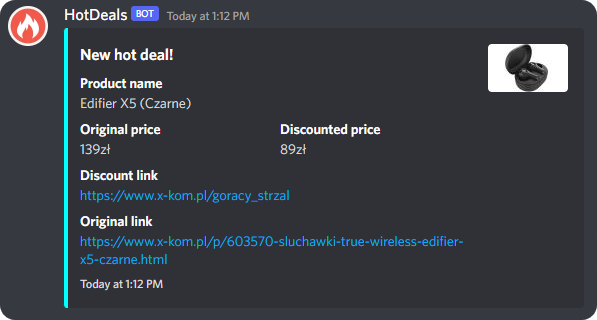

# HotDeals
Simple discord bot that fetches hot deals ("gorące strzały") from [x-kom](https://x-kom.pl). You can configure how often should bot check for a new deal through task commands.


## Commands
`+set-channel <id>` - Sets where the deals should appear. (**REQUIRED**)\
`+set-role <id>` - Sets the controller role, everyone with this role can start and stop repeating tasks. (**REQUIRED**)\
`+help` - Lists all available commands.\
`+start-task [period]` - Starts task with optional period, if none is specified - it will use a default one (15 minutes).
`+stop-task` - Stops the task that is already running.
## Installation
First, download latest .jar from [releases](https://github.com/zrdzn/FlameRegions/releases) tab, then run it by providing your
bot token as a program argument. For instance:
```BASH
java -Xms16M -Xmx128M -jar HotDeals-v1.0.0.jar TOKEN
```